# Tahoe-100M Group 6

An interactive, public-facing interface for exploring drug responses across
cell lines in the Tahoe-100M single-cell perturbation atlas.

## Project workflow

The editable Mermaid source is available at
[`docs/group6-workflow.mmd`](docs/group6-workflow.mmd), with a
presentation-ready [`PNG version`](docs/group6-workflow.png).

## Core research question

> Can we identify residual cell subpopulations that may be non-responders to a
> perturbation?

## Module responsibilities

| Module | Receives | Returns |
|---|---|---|
| **Public user interface** | User-selected drug, cell line, dose, gene, or pathway | Interactive visualizations, linked metadata, result tables, and analysis requests |
| **Population statistics** | Selected experimental condition and expression summaries | Response-distribution metrics, effect sizes, uncertainty, and candidate non-responder signals |
| **PCA analysis** | Selected drug/cell-line condition | PCA visualization and coordinates |
| **Dose trajectory analysis** | DMSO and available drug concentrations | Dose-aware transcriptional trajectory and plot |

The interface is the shared entry point. Analysis modules operate independently
and return standardized results to the interface for public display.

## Interface goals

- Explore responses by drug or cell line.
- Select a condition and launch an available statistical analysis.
- Compare response patterns across doses.
- Display linked drug, cell-line, sample, and experimental metadata.
- Present returned plots and tables through a non-technical public interface.
